Para esse projeto utilizei as seguintes tecnologias para rodar o projeto:

IDE: Intellij community;
Java: 22
Imports: 
- import java.rmi.registry.LocateRegistry;
- import java.rmi.registry.Registry;

Métodos utilizados em cada classe:

- RoomManager (Interface Remota)

`listRooms():` Retorna a quantidade de quartos disponíveis por tipo.

`bookRoom(int type, String guestName):` Reserva um quarto do tipo especificado para o hóspede informado.

`listGuests():` Retorna a lista de todos os hóspedes registrados.

- RoomManagerImpl (Implementação da Interface)

`listRooms():` Implementa a lógica para retornar a quantidade de quartos disponíveis.

`bookRoom(int type, String guestName):` Verifica disponibilidade e registra a reserva.

`listGuests():` Retorna os nomes dos hóspedes registrados.

- HotelServer

`main(String[] args):` Inicializa o servidor e registra o serviço RMI.

- HotelClient

main(String[] args): Interpreta os comandos do usuário e invoca métodos remotos.

 o args é o que recebe os valores que é digitado no console.

Como rodar o código.

Como eu criei duas classes para executar simultaneamente (HotelClient e HotelServer) é necessário utilizar dois CMDs para executar ambas.

## Etapa 01 (HotelServer)

1. Iniciar o CMD.
2. navegar até o arquivo HotelServer.jar (para isso utilizei o comando cd para navegar entre pastas) \

Exemplo:

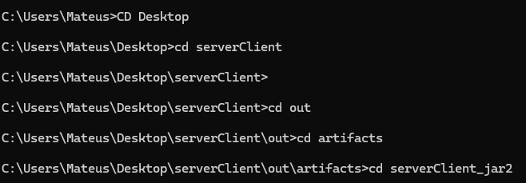\

Após chegar, utilizei o seguinte comando para executar o servidor: `C:\Users\Mateus\.jdks\openjdk-22.0.2\bin\java.exe -jar hotelServer.jar`

`C:\Users\Mateus\.jdks\openjdk-22.0.2\bin\java.exe` é o local onde está o meu Java no computador (você precisa passar o path do seu computador.)\
`-jar` é para executar o arquivo \
`hotelServer.jar` é o nome do arquivo\

Pronto, servidor rodando:
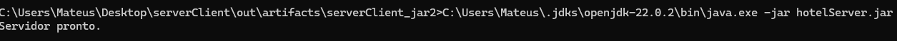

## Etapa 02 (ClientServe)

1. Iniciar o CMD.
2. navegar até o arquivo hotelClient.jar (para isso utilizei o comando cd para navegar entre pastas) \

Exemplo:

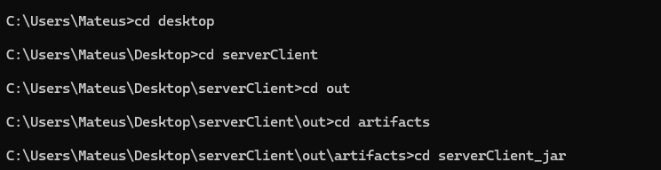

Após chegar, utilizei o seguinte comando para exercutar o cliente: `C:\Users\Mateus\Desktop\serverClient\out\artifacts\serverClient_jar>C:\Users\Mateus\.jdks\openjdk-22.0.2\bin\java.exe -jar hotelClient.jar`

Pronto, cliente está respondendo: 

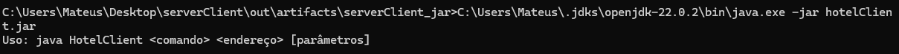

## Etapa 03 (comandos e retornos do cliente)

Agora, com o cliente e o servidor rodando, é possível dar os comando para realizar reservar. Obs: todo comando vai iniciar com: `C:\Users\Mateus\Desktop\serverClient\out\artifacts\serverClient_jar>C:\Users\Mateus\.jdks\openjdk-22.0.2\bin\java.exe -jar hotelClient.jar`

### list: se você nao passar nada: `C:\Users\Mateus\Desktop\serverClient\out\artifacts\serverClient_jar>C:\Users\Mateus\.jdks\openjdk-22.0.2\bin\java.exe -jar hotelClient.jar list`

Ele retorna quais parametros (args) estão faltando.
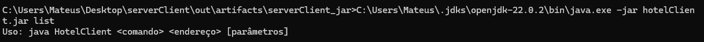

Caso você passe os argumentos corretos (comando + endereço), ele irá listar todos os quartos disponíveis.

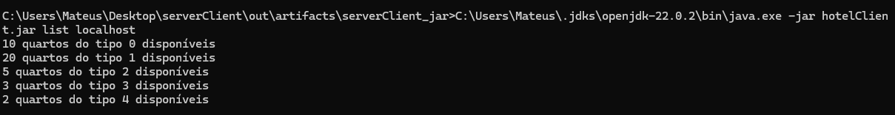

### Clientes: se você passa apenas 'clientes' como parâmetro: ele irá retornar como utilizar: `C:\Users\Mateus\.jdks\openjdk-22.0.2\bin\java.exe -jar hotelClient.jar clientes` 

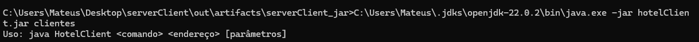

Caso você informe tanto 'clientes' quanto o endereço, ele irá retornar todos os clientes cadastrados com reserva:

Com clientes:

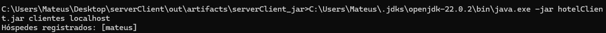

Sem clientes:

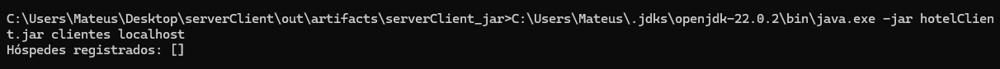

### book: se você passar apenas 'book' como parâmetro: ele irá retornar como utilizar: `C:\Users\Mateus\.jdks\openjdk-22.0.2\bin\java.exe -jar hotelClient.jar book`

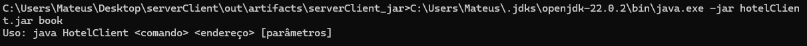

Caso você informe todos os argumentos, ele irá verificar se está disponível o quarto para alugar.

Caso esteja: ele guarda 1 a menos na memória do quarto (hash map) que foi reservado.(neste caso utilizei: `C:\Users\Mateus\.jdks\openjdk-22.0.2\bin\java.exe -jar hotelClient.jar book localhost 4 mateus`)

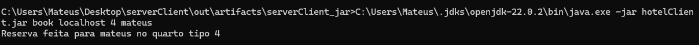

Caso não esteja: ele retorna a mensagem de que não possui reservas disponíveis para esse quarto(tipo):

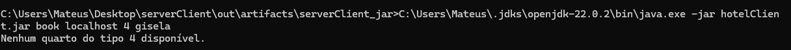

 Extra:
 
Caso você passe um endereço que não é valido, ele fica processando até dar timed out e retorna erro no console:
exemplo: 1.1.1.1, 8.8.8.8

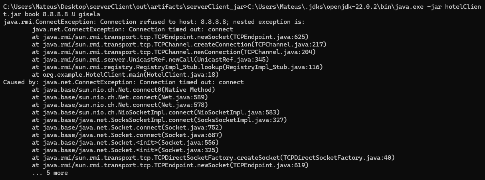

Eu também tentei passar o ipv6 e funcionou:

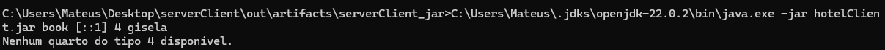

Conclusão: Nunca tinha trabalhado antes com Java RMI, então foi interessante aprender como funciona a comunicação remota entre cliente e servidor. Implementar a interface remota e lidar com os registros do RMI foi um desafio no começo, mas ajudou a entender melhor como as chamadas remotas funcionam. Também foi legal ver como os comandos do cliente interagem com o servidor e como garantir que as reservas fossem registradas corretamente. No final, foi uma experiência boa para aprender mais sobre sistemas distribuídos.